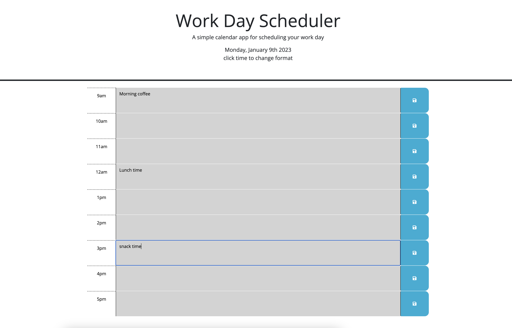

# dailyPlanner

## Table of Contents
* [Description](#Description)
* [Features](#Features)
* [Deployed-Site](#Deployed)
* [Usage](#Usage)
* [Screenshot](#Screenshot)
* [Technologies](#Technologies)

## Description

This application that allows you to You can create, view, and edit appointments for each hour of the work day. Your appointments will persist even after you reload the page!

## Features

- View the current day and date at the top of the page.
- Change the date and time format
- Plan your appointments by the hour

## Deployed Site

[Visit the deployed site](https://troynj.github.io/dailyPlanner/)

## Screenshot

 

## Usage

go to [my github repo](https://github.com/troynj/dailyPlanner) to clone the repo

## Technologies Used

| Technology Used         | Resource URL           | 
| ------------- |:-------------:| 
| Git | [https://git-scm.com/](https://git-scm.com/)     |   
| HTML    | [https://developer.mozilla.org/en-US/docs/Web/HTML](https://developer.mozilla.org/en-US/docs/Web/HTML) | 
| CSS     | [https://developer.mozilla.org/en-US/docs/Web/CSS](https://developer.mozilla.org/en-US/docs/Web/CSS)      |   
| JavaScript   | [https://developer.mozilla.org/en-US/docs/Learn/JavaScript](https://developer.mozilla.org/en-US/docs/Learn/JavaScript      |
| Bootstrap   | [https://getbootstrap.com/docs/5.3/getting-started/introduction/](https://getbootstrap.com/docs/5.3/getting-started/introduction/)     |
| jQuery API   | [https://api.jquery.com/](https://api.jquery.com/)  |
| jQuery UI  | [https://jqueryui.com/demos/](https://jqueryui.com/demos/)     |
| Day.js  | [https://day.js.org/](https://day.js.org/)    |
| Web APIs	 | [https://developer.mozilla.org/en-US/docs/Web/API](//https://developer.mozilla.org/en-US/docs/Web/API      |

## Author Information

### Troy 

* [Email]()
* [LinkedIn]()
* [Github]()